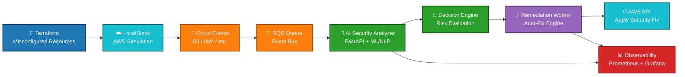

# 🛡️ Cloud-Remediation-Engine  
AI-Powered Autonomous Cloud Security & Remediation Platform  

Cloud-Remediation-Engine is a **cloud-native, AI-driven security automation platform** designed to detect, analyze, and automatically remediate misconfigurations in cloud environments in real time.

This project simulates a **production-grade Cloud Security Posture Management (CSPM)** system — capable of identifying security risks and autonomously fixing them within seconds.

Built entirely on **local infrastructure using LocalStack, Kubernetes, and event-driven architecture**, it enables zero-cost experimentation while maintaining real-world cloud behavior.

---

## 🌍 Overview

In large-scale cloud environments (AWS, Oracle, Huawei, etc.), thousands of resources are created daily.  
A single misconfiguration — such as a **public S3 bucket** — can lead to critical security breaches.

This platform goes beyond monitoring:

👉 It **detects threats using AI**  
👉 It **analyzes risks in real-time**  
👉 It **automatically remediates vulnerabilities**  

All without human intervention.

---

## 🧠 Core Concept

> "Don't just detect security issues — fix them autonomously."

The system continuously monitors cloud events, evaluates them using AI, and triggers automated remediation workflows.

---

## 🏗️ System Architecture

### 🔁 AI-Powered Event-Driven Remediation Pipeline



---

### 🧠 Architectural Flow

1. **Terraform** provisions intentionally misconfigured cloud resources  
2. **LocalStack** simulates AWS services in a fully local environment  
3. Cloud events (S3, IAM, etc.) are emitted and pushed into **SQS**  
4. The **AI Analyzer** consumes events and evaluates security risks  
5. The **Decision Engine** determines whether remediation is required  
6. The **Worker Service** executes automated fixes via AWS APIs  
7. All actions and metrics are exported to **Prometheus & Grafana**  

---

### ⚡ Key Architectural Principles

- **Event-Driven Design** → Fully asynchronous and scalable  
- **AI-Augmented Decision Making** → Intelligent security analysis  
- **Autonomous Remediation** → Zero human intervention  
- **Cloud-Native Deployment** → Kubernetes-ready microservices  
- **Observability First** → Real-time metrics and insights  

---

## ⚙️ Architecture Breakdown

### 🧱 1. Misconfiguration Simulation  
**(Terraform + LocalStack)**  

- Creates intentionally insecure cloud resources:
  - Public S3 buckets  
  - Weak IAM policies  
  - Misconfigured services  
- Fully simulated AWS environment with **LocalStack**  
- Zero cost, real cloud behavior  

---

### 📡 2. Event Capture Layer  
**(SQS / Event-Driven System)**  

- Every resource creation triggers an event  
- Events are pushed into an SQS queue  
- Enables asynchronous, scalable processing  

---

### 🤖 3. AI Security Analyzer  
**(FastAPI + AI Model)**  

- Consumes events from SQS  
- Sends configuration data to AI model  
- Determines:

```
"Is this configuration a security risk?"
```

- Uses:
  - NLP / RAG-based reasoning  
  - Rule-based + AI hybrid analysis  

---

### ⚡ 4. Autonomous Remediation Engine  

- If risk is detected:
  - Automatically triggers remediation  
- Examples:
  - Public S3 → set to private  
  - Weak IAM → restrict permissions  

No human intervention required.

---

### ☸️ 5. Cloud-Native Deployment  
**(Kubernetes + ArgoCD)**  

- Services deployed on **Minikube**  
- GitOps-based deployment using **ArgoCD**  
- Fully automated infrastructure lifecycle  

---

### 📊 6. Observability & Monitoring  
**(Prometheus + Grafana)**  

Real-time dashboards showing:

- 🚨 Prevented vulnerabilities  
- ⏱️ AI decision latency  
- 🔐 Remediated resources  
- 📈 System health metrics  

---

## 🧰 Technology Stack

| Layer | Technology | Purpose |
|------|------------|--------|
| Cloud Simulation | LocalStack | AWS environment locally |
| IaC | Terraform | Misconfiguration simulation |
| Messaging | AWS SQS | Event-driven architecture |
| Backend | FastAPI (Python) | AI analyzer service |
| AI Layer | NLP / RAG Models | Security decision engine |
| Worker | Python | Auto-remediation execution |
| Orchestration | Kubernetes (Minikube) | Service management |
| GitOps | ArgoCD | Continuous deployment |
| Monitoring | Prometheus | Metrics collection |
| Visualization | Grafana | Dashboards |
| Runtime | Docker | Containerization |

---

## 📂 Project Structure

```
cloud-remediation-engine/
├── README.md
├── infrastructure/
├── localstack/
├── k8s/
├── services/
```

---

## 🚀 Setup & Installation (High-Level)

### 1️⃣ Start LocalStack
```
docker-compose up -d localstack
```

### 2️⃣ Deploy Infrastructure
```
terraform init
terraform apply
```

### 3️⃣ Start Kubernetes
```
minikube start --driver=docker
```

### 4️⃣ Deploy Services
```
kubectl apply -f k8s/
```

---

## 👨‍💻 Developer  

**Ali Gaffar Toksoy**  

> "Modern infrastructure shouldn't just run — it should think, detect, and heal itself."